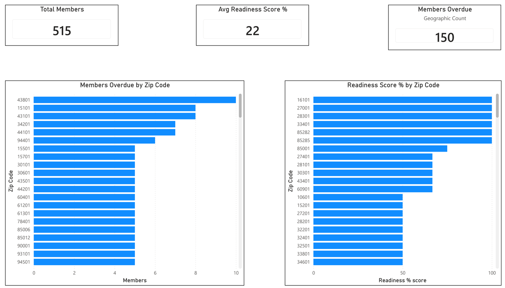
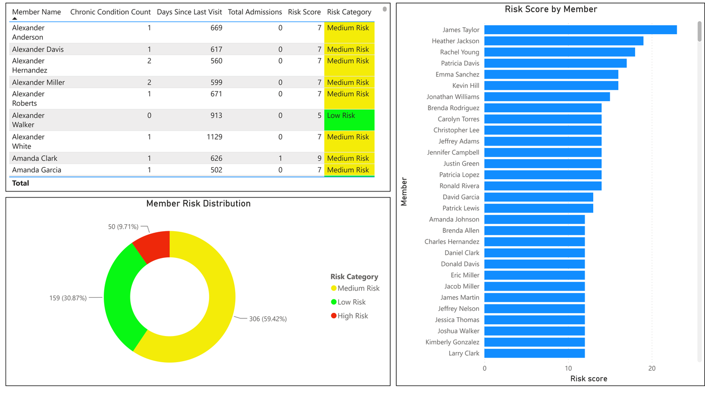
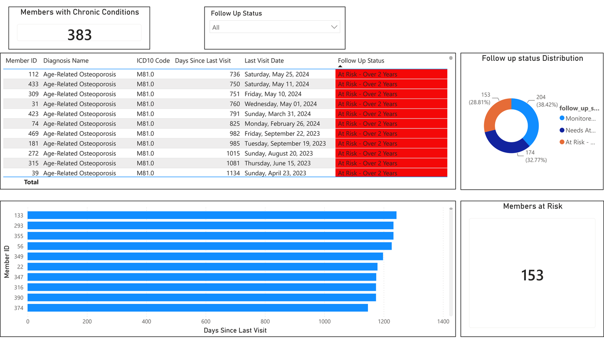
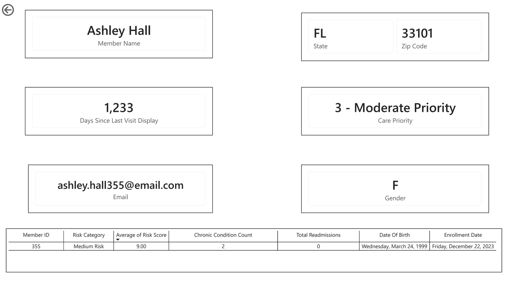

<div align="center">

```
██████╗  ██████╗ ██████╗     ██╗  ██╗███████╗ █████╗ ██╗  ████████╗██╗  ██╗
██╔══██╗██╔═══██╗██╔══██╗    ██║  ██║██╔════╝██╔══██╗██║  ╚══██╔══╝██║  ██║
██████╔╝██║   ██║██████╔╝    ███████║█████╗  ███████║██║     ██║   ███████║
██╔═══╝ ██║   ██║██╔═══╝     ██╔══██║██╔══╝  ██╔══██║██║     ██║   ██╔══██║
██║     ╚██████╔╝██║         ██║  ██║███████╗██║  ██║███████╗██║   ██║  ██║
╚═╝      ╚═════╝ ╚═╝         ╚═╝  ╚═╝╚══════╝╚═╝  ╚═╝╚══════╝╚═╝   ╚═╝  ╚═╝
```

# Population Health Analytics Dashboard

**Member Care Management & Risk Stratification System**


*Transforming raw healthcare data into actionable clinical intelligence*

</div>

---

## 📋 Overview

A **Population Health Analytics Dashboard** built to support a regional health plan's care management operations. Enables clinical and operational teams to monitor member preventive care compliance, identify high-risk individuals, and prioritize outreach across a 515-member population.

```
GEOGRAPHIC COVERAGE  ──►  CHRONIC CONDITIONS  ──►  RISK STRATIFICATION  ──►  MEMBER 360
   Leadership               Clinical Teams            Care Managers            Case Workers
   "Where are              "Who has critical         "Who needs to            "Full profile
    the gaps?"              care gaps?"               be called first?"        before the call"
```

---

## 🗂️ Repository Structure

```
population-health-analytics/
│
├── 📁 sql/
│   ├── vw_member_risk.sql            # Weighted clinical risk scoring
│   ├── vw_chronic_followup.sql       # Chronic condition follow-up tracking
│   └── vw_readiness_summary.sql      # Geographic preventive care coverage
│
├── 📁 powerbi/
│   └── population-health.pbix        # Power BI Desktop report
│
├── 📁 docs/
│   ├── Member_Risk_Score_Methodology.pdf
│   ├── Readiness_Score_Methodology.pdf
│   └── Healthcare_Data_Model_Methodology.pdf
│
└── README.md
```

---

## 🗄️ Data Architecture

### Power BI Data Sources

| Source | Type | Description |
|---|---|---|
| `members` | Table | Core member demographics — 515 members |
| `Claims` | Table | Member claims records |
| `Date Table` | Table | Date dimension for time intelligence |
| `vw_member_risk` | View | Individual risk scores and care priority |
| `vw_chronic_followup` | View | Chronic condition follow-up status |
| `vw_readiness_summary` | View | Geographic preventive care rates |

> **Note:** `diagnoses`, `patient_visits`, `admissions`, and `readmissions` feed the SQL views but are not loaded directly into Power BI.

---

## 🧮 Scoring Models

### Member Risk Score

A composite clinical score combining four weighted factors:

```
┌─────────────────────────────────────────────────────────────┐
│                    RISK SCORE FORMULA                        │
│                                                              │
│  (Chronic Conditions × 2)                                   │
│  + Days Since Last Visit  →  ≤90d = 1 │ ≤120d = 2 │ >120d = 3 │
│  + (Hospital Admissions × 2)                                │
│  + (Readmissions × 3)                                       │
│  + Preventive Visit Gap  →  No visit in 24mo = +2           │
└─────────────────────────────────────────────────────────────┘
```

| 🔴 High Risk | 🟡 Medium Risk | 🟢 Low Risk |
|:---:|:---:|:---:|
| Score ≥ 10 | Score 6–9 | Score ≤ 5 |

### Care Priority Matrix

Members are assigned one of six actionable priority tiers:

| Priority | Risk | Preventive Visit | Action |
|---|---|---|---|
| 🔴 **1 - Critical** | High | No visit in 24 months | Immediate outreach |
| 🟠 **2 - High Priority** | High | Has recent visit | Close monitoring |
| 🟡 **3 - Moderate Priority** | Medium | No visit in 24 months | Proactive outreach |
| 🟨 **4 - Monitor** | Medium | Has recent visit | Routine monitoring |
| 🔵 **5 - Routine Outreach** | Low | No visit in 24 months | Wellness reminder |
| 🟢 **6 - Healthy** | Low | Has recent visit | No action needed |

### Readiness Score

```
Readiness Score % = (Members Current ÷ Total Members) × 100
```

A member is **current** if they have had a preventive visit within the last **24 months**.
Calculated at **state and zip code level** to support regional outreach planning.

### Chronic Follow-Up Status

| Status | Days Since Last Visit |
|---|---|
| 🔴 At Risk - Over 2 Years | > 730 days |
| 🟠 Needs Attention - Over 18 Months | 549–730 days |
| 🟡 Monitored - Over 1 Year | 366–548 days |
| 🟢 Current | ≤ 365 days |
| ⬜ No Visits On Record | No visit exists |

---

## 📊 Report Pages

<details>
<summary><b>Page 1 — Executive Summary</b> · Geographic Coverage</summary>

> *"Where are our preventive care compliance gaps?"*



| Visual | Purpose |
|---|---|
| Total Members KPI | Population scale |
| Avg Readiness Score % | Overall compliance rate |
| Members Overdue | Geographic zones with gaps |
| Members Overdue by Zip Code | Horizontal bar — highest gaps first |
| Readiness Score % by Zip Code | Sorted bar — lowest compliance at top |

</details>

<details>
<summary><b>Page 2 — Member Risk</b> · Population Risk Stratification</summary>

> *"How is our population distributed across risk tiers?"*



| Visual | Purpose |
|---|---|
| Risk Distribution donut | Population-level risk overview |
| Risk Score by Member | Top risk individuals by name |
| Member risk matrix table | Chronic conditions, days since visit, admissions, risk score |

</details>

<details>
<summary><b>Page 3 — Chronic Conditions</b> · Follow-Up Tracking</summary>

> *"Which members have the most critical care gaps?"*



| Visual | Purpose |
|---|---|
| Members with Chronic Conditions KPI | Chronic population count |
| Follow Up Status slicer | Filter by urgency |
| Condition detail table | Diagnosis, ICD-10, days since visit, follow-up status |
| Status Distribution donut | Population breakdown by urgency |
| Days Since Last Visit chart | Members by gap severity — drill-through enabled |
| Members at Risk KPI | At Risk member count |

</details>

<details>
<summary><b>Page 4 — Member Detail</b> · Individual 360 View</summary>

> *"Everything needed before making an outreach call."*

Accessible via **drill-through** from the Chronic Conditions page.



| Visual | Content |
|---|---|
| Member Name | Full name |
| State / Zip Code | Location |
| Days Since Last Visit | Clinical contact recency |
| Care Priority | 1-Critical through 6-Healthy |
| Email | Contact information |
| Gender | Demographics |
| Detail table | ID, Risk Category, Risk Score, Chronic Count, Readmissions, DOB, Enrollment Date |

</details>

---

## ⚙️ Power BI Service

### Row-Level Security

```
Role: AZ Only  →  members[state] = "AZ"
```
> Only **Viewer** and **App User** roles are restricted by RLS.
> Admin, Member, and Contributor workspace roles bypass RLS automatically.

### Scheduled Refresh

| Setting | Value |
|---|---|
| Gateway | On-premises data gateway |
| Source | MySQL — healthcare_analytics |
| Frequency | Daily |
| Time Zone | UTC-07:00 Mountain Time |

### Power BI App

Published as **Healthcare Analytics** — selective content access without workspace exposure. RLS enforced via dataset Security settings.

---

## 🛠️ Technical Stack

| Layer | Technology |
|---|---|
| **Database** | MySQL 9.5.0 |
| **Data Modeling** | Power BI Desktop |
| **Visualization** | Power BI Service (Pro) |
| **Connectivity** | On-premises data gateway |
| **Security** | RLS + Power BI App permissions |
| **Deployment** | Power BI Deployment Pipeline |

---

## 📐 DAX Measures

```dax
-- Days since last visit — no K abbreviation
Days Since Last Visit Display =
FORMAT(MAX(vw_member_risk[days_since_last_visit]), "#,0")

-- Care priority for drill-through context
Care Priority =
SELECTEDVALUE(vw_member_risk[care_priority])

-- Member age from date of birth
Age = DATEDIFF('members'[dob], TODAY(), YEAR)

-- Readiness percentage with symbol
Readiness Score % =
AVERAGE(vw_readiness_summary[readiness_score_pct]) & "%"
```

---

## 💬 Project Narrative

> *"This population health dashboard supports a regional health plan's care management operations. It moves users through a logical analytical drill-down: leadership views geographic coverage to identify zip codes falling below preventive care targets; clinical teams use chronic condition tracking to find members with significant care gaps; care managers use the risk stratification page to isolate high-risk individuals based on a weighted index of chronic conditions, hospital admissions, and visit recency — enabling proactive, prioritized outreach."*

---

## 📄 Documentation

Full methodology documentation included in `/docs`:

| Document | Contents |
|---|---|
| `Member_Risk_Score_Methodology.pdf` | Risk formula, component weights, worked example |
| `Readiness_Score_Methodology.pdf` | Readiness formula, thresholds, score interpretation |
| `Healthcare_Data_Model_Methodology.pdf` | Complete data model — all views, logic, clinical rationale |

---

<div align="center">

**Population Health Analytics Dashboard**
Ahmed Isse · May 2026

</div>

